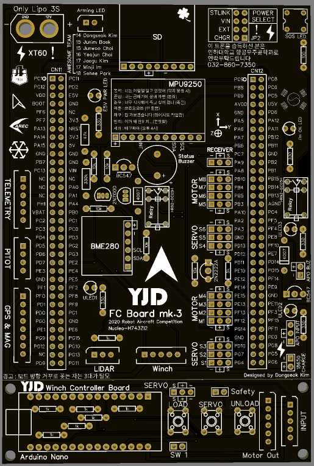
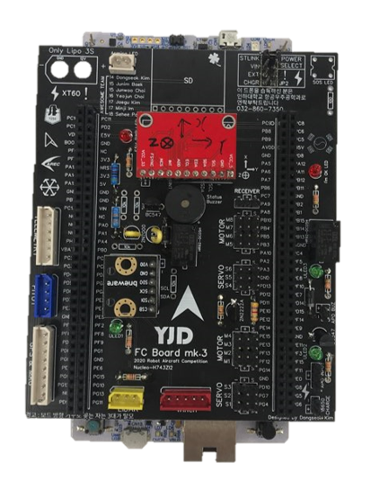
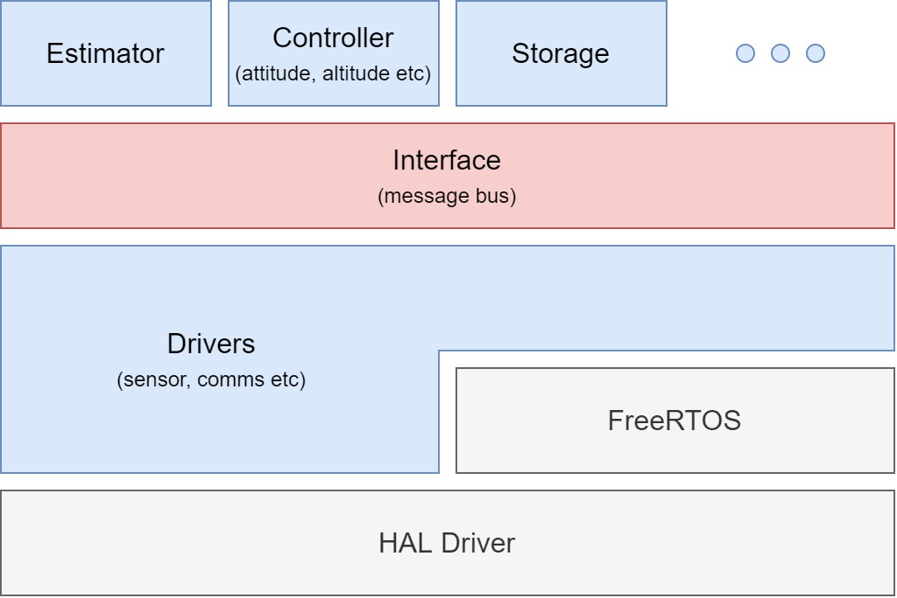

# Selfmade flight control system
This project is for the KRAC(Korea Robot Aircraft Competition). 
In this competition a box(300g) should carried by a drone using winch. 
At the same time, the drone should pass some waypoints and detour a no-fly zone.

    

## Design elements
### hardware
* Payload : 300g
* Weight : 3.2kg (experimentally)
* Flight time : 20 minutes (approximate time for mission)
* 1.9 < thrust/weight < 3.0 (to fly well enough even in strong winds)
* 0.2 < watt/weight < 0.3 (to fly stably)
* Length of winch's rope : 2m (rule of the KRAC)
### software
* Drone should be controlled automatically using GPS data.
* Drone should be controlled by manual in emergency situation.

## Used peripheral for FCS
* NucleoH743ZI2 (OBC)
* MPU9250 (IMU)
* BME280 (barometer)
* IST8310 (magnetometer)
* ublox neo-m8n (GPS)
* FrSky X8R (receiver)
* Holybro 915Mhz (telemetry)

    
    

## Used Tool
* C++ (language)
* feeRTOS (RTOS)
* CubeIDE (IDE)
* CubeMonitor (data monitoring tool)
* Matlab/Simulink (to design controller)

## Architecture
We refered PX4's firmware to make up for our lack of experience. 
So, we struggled to modularize by function. 
We used interface for publishing or subscribing intertask data.
So, even if a module is replaced by a new module, it use the interface for the other task can work.

    

* [to driver folder](https://github.com/ch-jwoo/FlightController/tree/stm32h743/CPP/Peripherals)
* [to interface folder](https://github.com/ch-jwoo/FlightController/tree/stm32h743/CPP/Interface)
* [to estimator folder](https://github.com/ch-jwoo/FlightController/tree/stm32h743/CPP/Module/Estimator)
* [to controller folder](https://github.com/ch-jwoo/FlightController/tree/stm32h743/CPP/Module/Controller)
* [to storage folder](https://github.com/ch-jwoo/FlightController/tree/stm32h743/CPP/Module/Storage)
   
But I think It was fail. 
We couldn't implement a message managing task like uorb in pixhawk because of the short development period. 

## Result
The vehicle was controlled automatically well.
